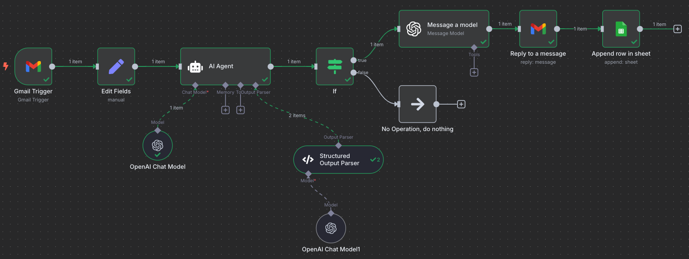
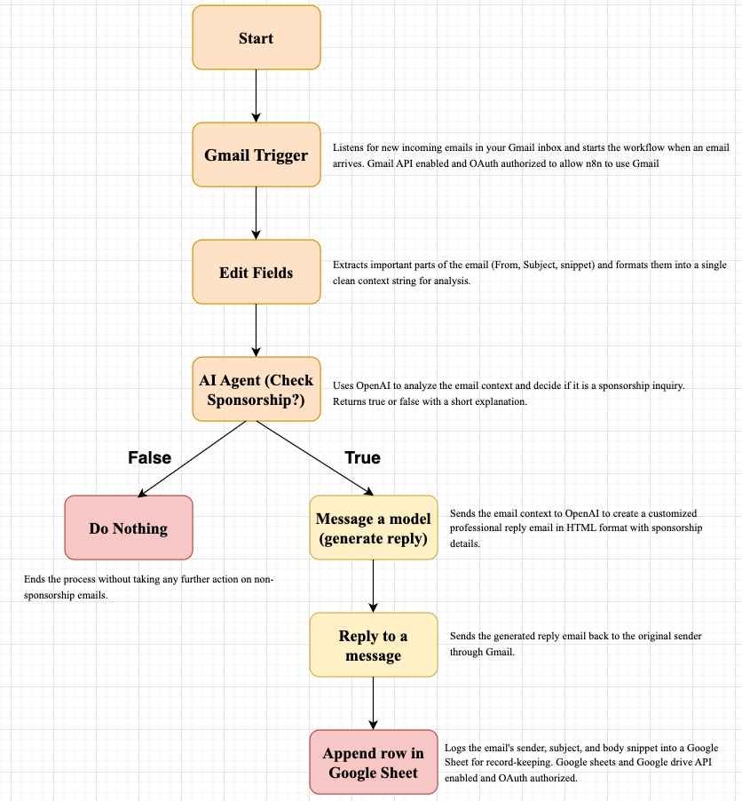

# AI-Powered Email Automation: Filtering Messages and Auto-Replying

## Overview

This project is an action-enabled AI email automation system designed to automatically filter emails related to sponsorship deals and reply with a personalized professional message. All non-sponsorship emails are ignored.

The system is implemented using n8n, an open-source workflow automation tool, and integrates with Gmail, OpenAI, and Google Sheets APIs.

## System Description

The system automates email triage and reply tasks using the following components:

- **AI Classification**: Uses OpenAI's language model to analyze email content and classify it as a sponsorship inquiry or not.
- **Automated Reply**: Generates a tailored HTML email response for sponsorship emails.
- **Logging**: Saves details of sponsorship emails (sender, subject, snippet) into a Google Sheet for tracking.

## Workflow Actions Performed

1. **Gmail Trigger**
   - Listens for new incoming emails in the Gmail inbox.

2. **Edit Fields**
   - Formats and combines important fields (From, Subject, Body snippet) into a single string called "Email Context" for AI analysis.

3. **AI Agent**
   - Sends the formatted email context to the OpenAI model for classification.

4. **OpenAI Chat Model**
   - Provides the underlying large language model capability for the AI Agent.

5. **Structured Output Parser**
   - Parses and validates the AI response, extracting structured fields (`isSponsorship` and `reasoning`).

6. **If Node**
   - Checks the `isSponsorship` field and decides further actions:
     - **True**: Proceed to generate and send a reply.
     - **False**: End the workflow without taking further action.

7. **Message a model**
   - Generates a professional, HTML-formatted reply email including sponsorship details and channel policies.

8. **Reply to a message**
   - Sends the generated HTML reply back to the original email sender via Gmail.

9. **Append row in sheet**
   - Logs sender, subject, and body snippet into a connected Google Sheet for record-keeping.

10. **No Operation, do nothing**
    - If the email is not a sponsorship inquiry, the system stops here and does nothing further.

## Endpoints and Services Used

| Service         | Purpose                                       |
|-----------------|-----------------------------------------------|
| Gmail API       | To receive new emails and send reply messages.|
| OpenAI API      | To classify email content and generate replies.|
| Google Sheets API | To log sponsorship emails for future tracking.|

## Setup

1. Clone or download this repository.
2. Install and configure n8n locally or on a server.
3. Import the provided `Sponsor Reply.json` workflow into n8n.
4. Upload the provided flow diagram screenshot as `flow-diagram.png` in the same repository directory.
5. Set up and authorize Gmail, OpenAI, and Google Sheets credentials within n8n.
6. Start the workflow and test it by sending example emails.

## How to Run

1. Open terminal and type n8n (n8n is running on port 5678 (locally))

## Features

- Automatically detects sponsorship-related emails.
- Sends a personalized, detailed HTML reply for sponsorship inquiries.
- Logs important email details in a Google Sheet.
- Ignores non-sponsorship emails to reduce noise and manual effort.

## License

MIT License

